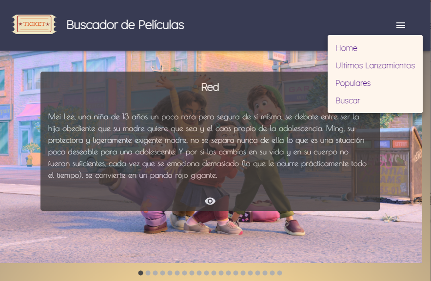

# PROYECTO BUSCADOR DE PELICULAS

Proyecto realizado  en [React](https://reactjs.org/) como TP Final dentro de la cursada de la certificación como desarrolladora FrontEnd en ADA ITW.

Detalles funcionales:
- La aplicación debe conectarse a una Api que provea información sobre películas.
- La plicacion debe tener una sección principal (Home), con un Carrousel y dos componente que presenten listados de peliculas mejor puntuadas y ultimos lanzamientos.
- El Nav debe tener 4 items de menú:
  -  Home
  -  Ultimos lanzamientos
  - Populares
  - Buscador
- Debe tener un Footer con links a redes sociales e información de contacto.
- Dentro de cada una de las secciones, la información debe ser mostrada como un componente "Tarjeta" y cada una, debe tener un link al "Detalle" de cada película.

### Se utlizaron las siguientes librerías:
* Los componentes fueron realizados con: [Material UI](https://mui.com/)
* El Carrousel principal del Home fue realizado con: [Learus - react-material-ui-carrousel](https://github.com/Learus/react-material-ui-carousel) - [live Demo](https://learus.github.io/react-material-ui-carousel/)

### La tipografía elegida es:
[Lexend Deca](https://fonts.google.com/specimen/Lexend+Deca?preview.size=35&category=Sans+Serif&preview.text=Buscador%20de%20pel%C3%ADculas&preview.text_type=custom) se importó desde [GoogleFonts](https://fonts.google.com/?preview.size=35).

### Api:
El front se conecta a [The Movie Database](https://www.themoviedb.org/) a fin de obtener la imágenes y los contenidos de cada consulta.
La documentación de dicha api se puede consultar en: [Link documentación Api](https://developers.themoviedb.org/3/movies)

### Deployado con:
- Netlify: [Bucador de peliculas](https://buscador-peliculas-sandram.netlify.app/)

Para trabajar con estos archivos en forma local, luego de clonar el repositorio, ejecutar los siguientes comandos:

- npm install
- npm start